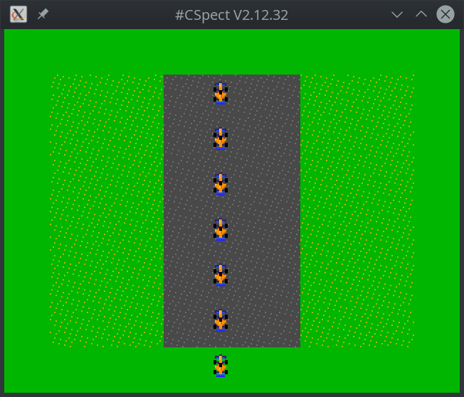

# Atari driving controller (paddle) example

## what it does

Reads "Kempston 2" joystick port. If you happen to have Atari driving controller -
**NOT** the analog paddle - these two are different, make sure you get the driving
one which does produce serial sequence on "up/down" directions of Kempston joystick pins.

So if you happen to have one, you can use it to control the formula car on the screen.

The example is reading the joystick port continuously (I didn't calculate the actual
T states of the inner loop, but I guess even on 3.5MHz it's probably hundreds of times
per single frame) and it keep adjusting position X of the sprite based on the value "D".

The value "D" is incremented when the paddle knob is rotated clockwise, and decremented
when the knob is rotated counter-clockwise, going full range 0..255.

## disclaimer

This is rather **test** than *example*. If you are planning to create your own game
supporting this kind of controller, control scheme like this will feel very insensitive
and numb... and dumb. You should rather use value "D" as wheel angle and maybe even add
some further dynamics to the car handling to make it more fun. This code is just example
how to read the port and how to turn the readings into +1/-1 of the value "D".

## how to build it

You will need [sjasmplus](https://github.com/z00m128/sjasmplus) (v1.14.4+).

## how it works

The paddle sends two-bit values in bits 2 and 3 (down/up on Kempston interface). When
you turn the knob, the value is modified.

You can imagine it as two-bit window over infinite tape consisting of ...001100110011...
pattern, so when you turn knob clockwise, the values sequence will be 00, 01, 11, 10, 00,
01, ... Counter-clockwise sequence will be 00, 10, 11, 01, 00, 10, ...

Due to this, if you sample the port often enough, it is enough to compare "old" bit 3
with "new" bit 2. If they are equal, the user is turning knob counter-clockwise, if they
are different, the user is turning knob clockwise (of course if both readings are
completely identical in both bits, then the user is not turning knob at all).

Based on this logic the value "D" (in register `D`) is adjusted by +-1 and the sprite
is positioned directly at the "D" value (for testing purposes).

Also the code keeps reading video-line low byte, and moves the sprites every 32 pixels
just ahead of the display beam, so you can see the formula sprite for most of the
screen space (it's the same sprite).

## thanks, author, license, ...

Big thanks to "Smurphboy" and "SevenFFF" at Next discord server for providing me with
the "protocol" specs and testing the example on actual HW.

© Peter Helcmanovsky 2020, license: https://opensource.org/licenses/MIT

v1.0 of example released at 2020-08-07.
