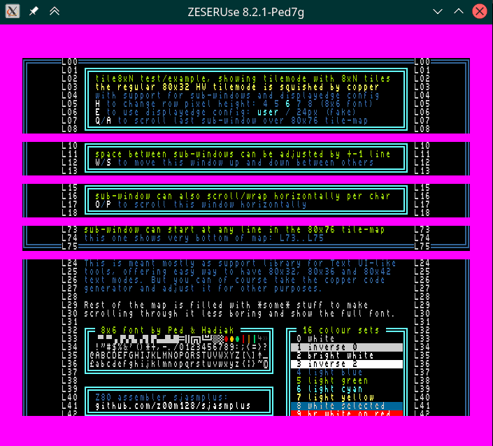

# HW tile-modes with 8xN tiles

Regular 4bpp tilemode 80x32 of ZX Spectrum Next is used as base.

This library generates copper-code for provided configuration, squishing the regular 80x32 mode to display more rows (for example 80x42.6 with 8x6 tiles) and dividing the screen vertically into sub-windows.

The library cooperates with displayedge runtime library, making it easier to target only screen area which user marked as visible.

The copper code generator is fast enough to react on-the-fly to user changing screen modes (50/60Hz), or generate new code when configuration of display is modified by application.

## purpose of this library

This library is meant mostly as help for TUI-like applications, wanting to use HW tilemode of ZX Spectrum Next. By using this library you can offer user more rows of text on the screen (for the price of somewhat smaller font) - somewhat similar to PC DOS applications allowing for EGA/VGA lines, and dynamically adjust your screen layout based on user's visible-margin configuration stored in system config, reacting also on-the-fly to user changing video mode by NMI+3 shortcut.

It's also easy to split screen into independent vertical areas, displaying different parts of tile-map, or having bottom status line displaying content of first row from fixed address $4000, etc..

Emulator warning: as of today, the library does display correctly only in #CSpectV2.14.8 (but horizontal scrolling is bugged) and in my "ZESERUse" fork of ZEsarUX. I'm not aware of other emulators capable to display this effect correctly.

## using library as source code included into your project

Check the example/test8xN.asm for the code example.

Decide on row pixel height (6 is default, unless you modify it), call `tile8xN.ChangeRowHeight` to reconfigure the code of the library accordingly, and upload desired font data into "Bank 5" toward end of the bank (to get as much space for the virtual tile-map starting at $4000, in regular 80x32 mode each row needs 160 bytes, so with font data at $7000 you have 80x76 virtual tile-map. You can modify the video init routine to also use other tile modes using only 80 or 40 bytes per row or 1bpp tile graphics data, but then you must adjust all relevant code in the library to calculate with these.

Call `tile8xN.InitVideo` once to make the library set tilemode, disable ULA screen, set palette and clip window and clear the virtual tile map.

Use displayedge library's `dspedge.ParseCfgFile` to read the user config for visible display margins into `tile8xN.DisplayMarginsArr` array.

That should be enough to have 8xN mode initialised, except the on-the-fly parts.

Then in your main loop either force reinit when you modified the display-map configuration, or call `tile8xN.CopperNeedsReinit` to detect video mode change produced by user (50/60Hz, etc).

In case the copper code needs reinit, call `tile8xN.SetCopperIsInitialized`, use `tile8xN.GetModeData` to evaluate current video mode (how many video-lines are invisible margin, and how many tile-rows are remaining in the visible area), and based on the returned value reconfigure your display-map data. With reconfigured display-map finally call `tile8xN.CopperReinit` to let the copper generator write new code into copper and restart it.

## display-map configuration

Display-map configuration is array of `tile8xN.SDisplayMap` structures, splitting screen vertically into sub-windows (as many as you wish and could fit onto screen). Each item consists of number of video-lines to skip (creating top-margin of the sub-window), number of tile-rows, Y position of first row in the virtual tile-map, and X position to scroll/wrap all rows by.

This allows among other things to have for example status row displayed at the bottom of the screen, yet using the first row of map making printing into status row always target line starting at $4000, making it independent from the total number of visible rows on screen, or displaying two sub-windows in consecutive way creating seamless wrap from last row of tile-map into first row, making infinite vertical scrolling possible, etc... I'm sure you are enough creative to find other possibilities I haven't even think of.

[advanced] The example doesn't show it, but you can handle also horizontal margins defined by displayedge utility by scrolling X position in opposite way (79 for 1 to 8 pixel left margin, 78 for 9 to 16 left margin, ...) and set up clip-window to hide these columns, making it appear as if the row text starts at the edge of the screen, while it still does start at X=0 in tile-map, making print code unaware of the user's margin. But you need to account for shorter (not 80 columns) rows visible then. The example does only showcase the horizontal scrolling done by the xOffset value, without the extra clipping or reacting to user config.

## other helper functions included in the library

There are few basic helper functions to print/clear the tile-map, or calculate address of particular position/row in the tile-map. Explore the library source code directly for details how to call them:

| API function | description |
| --- | --- |
| `ChangeRowHeight` | change pixel height of single row (default 6) |
| | does modify code of GetModeData and CopperReinit to operate with new size |
| `InitVideo` | set up tilemode 80x42 (except copper), ... |
| | also shifts scanline "0" 33 lines up with nextreg $64 |
| `CopperNeedsReinit` | ZF=0 when copper needs reinit (mode change detected) |
| `SetCopperIsInitialized` | clears the "needs reinit" flag |
| `GetModeData` | gets config data by dspedge.MODE_* value |
| `CopperReinit` | generate copper code (when map-config changes) |
| `ClearScreen` | sets whole virtual map ($4000..font) to ' ' in color 0 |
| `SetFullTilemapPalette` | (internal) setup tilemode palette |
| `CalcTileAddress` | memory address of particular single character |
| `CalcLineAddress` | memory address of particular row (in virtual map) |
| `WriteSpace` | fills "rectangle" in virtual map with ' ' in color 0 |
| `Print` | print C-string |
| `PrintChar` | print single character |
| `AdvancePos` | advance BC coordinates to next position in virtual map |

## example app controls

H - change row pixel height (4, 5, 6, 7, 8)

E - reconfigure top-margin either by system configuration (set from dot command displayedge), or hard-coded 24 pixel margin.

Q/A - to scroll the bottom sub-window content over whole tile-map, including the area where font data are stored

W/S - to adjust skip-lines around second sub-window, making it to move up/down within the space between first and third area.

O/P - scroll horizontally the third sub-window content

